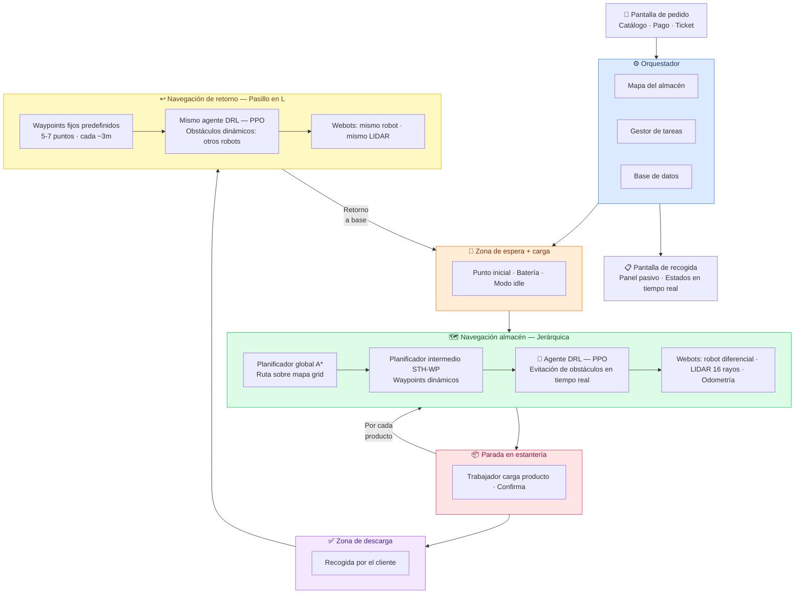

# 🤖 Sistema de Robots Autónomos con RL para Almacenes IKEA

<div align="center">


**Trabajo de Fin de Máster**
Adriana García · Máster en Inteligencia Artificial Aplicada
Universidad Carlos III de Madrid · 2025/2026

</div>

---

## 💡 ¿De qué trata este proyecto?

Imagina un almacén de IKEA donde robots autónomos recogen productos de las estanterías y los entregan al cliente en la zona de descarga, **sin intervención humana en la navegación**.

Este TFM diseña e implementa ese sistema completo: desde que el cliente hace el pedido en una pantalla táctil, hasta que el robot deposita el producto y regresa a su base por un pasillo separado.

El reto central es la **navegación autónoma en un entorno dinámico y complejo**: el robot debe encontrar su camino entre estanterías, evitar obstáculos en tiempo real, detenerse en el punto exacto de recogida, y volver sin interferir con otros robots. Todo esto usando **Deep Reinforcement Learning** — el robot aprende a moverse a base de experiencia, igual que aprendemos a conducir.

---

## 🧠 Arquitectura del sistema

El sistema se organiza en tres grandes bloques: la **interfaz de usuario**, el **orquestador** (el cerebro del sistema) y el **robot en simulación**.



---

## 🔑 Componentes principales

| Componente | Tecnología | Función |
|---|---|---|
| Simulación | **Webots R2023b** | Entorno 3D del almacén, física del robot |
| Robot | Diferencial + **LIDAR 16 rayos** | Percepción y movimiento |
| Agente RL | **PPO (Stable-Baselines3)** | Navegación local, evitación de obstáculos |
| Planificador global | **Algoritmo A\*** | Ruta óptima entre estanterías |
| Waypoints dinámicos | **STH-WP** | Enlace entre planificador y agente DRL |
| Interfaz | **Flask / Streamlit** | Pedidos, pagos, seguimiento |
| Orquestador | **Python** | Coordinación del sistema completo |

---

## 📂 Estructura del repositorio

```
tfm-robots-ikea-rl/
├── 📁 simulacion/
│   ├── worlds/          # Escenas .wbt de Webots
│   ├── controllers/     # Controladores Python del robot
│   └── protos/          # Modelos 3D personalizados
├── 📁 agente/
│   ├── models/          # Modelos entrenados (.zip)
│   ├── logs/            # Logs de TensorBoard
│   └── checkpoints/     # Checkpoints del entrenamiento
├── 📁 orquestador/      # Lógica central de coordinación
├── 📁 interfaz/         # Aplicación Flask (pedido + recogida)
├── 📁 experimentos/
│   ├── resultados/      # Métricas en CSV
│   └── graficas/        # Plots y visualizaciones
├── 📁 datos/            # Mapa JSON del almacén, waypoints
└── 📁 memoria/          # Borradores del documento TFM
```

---

## 🗺️ Plan de trabajo

El proyecto se divide en **8 fases** secuenciales:

| Fase | Contenido | Tipo |
|---|---|---|
| **1** | Revisión bibliográfica y estado del arte | Memoria |
| **2** | Entorno de simulación en Webots | Desarrollo |
| **3** | Agente DRL con PPO ← *núcleo del TFM* | Desarrollo |
| **4** | Sistema de navegación jerárquico (A* + STH-WP) | Desarrollo |
| **5** | Navegación de retorno por pasillo en L | Desarrollo |
| **6** | Interfaz de usuario y orquestador | Desarrollo |
| **7** | Experimentación y resultados | Ambos |
| **8** | Cierre de la memoria y defensa | Memoria |

---

## ⚙️ Instalación y uso

```bash
# 1. Clonar el repositorio
git clone https://github.com/TU_USUARIO/tfm-robots-ikea-rl.git
cd tfm-robots-ikea-rl

# 2. Crear entorno virtual
python -m venv venv
source venv/bin/activate  # En Windows: venv\Scripts\activate

# 3. Instalar dependencias
pip install -r requirements.txt

# 4. Abrir el entorno en Webots
#    File → Open World → simulacion/worlds/almacen_ikea.wbt
```

> ⚠️ Requiere **Webots R2023b** instalado. Descarga en [cyberbotics.com](https://cyberbotics.com)

---

## 📚 Referencias clave

- Kästner et al. (2021) — *Connecting the Dots: Using a Gantt Chart-Inspired Planner for Connecting Heterogeneous Robot Navigation Layers*
- Schulman et al. (2017) — *Proximal Policy Optimization Algorithms*
- Raffin et al. (2021) — *Stable-Baselines3: Reliable Reinforcement Learning Implementations*

---

<div align="center">
<sub>Adriana García · Universidad Carlos III de Madrid · 2026</sub>
</div>
