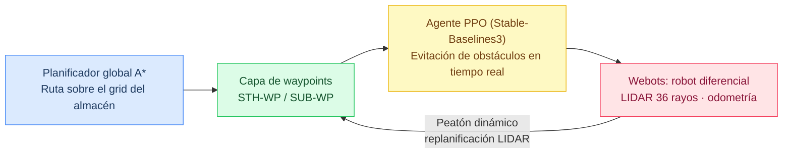

# 🤖 Navegación autónoma con RL para robots de almacén

<div align="center">


**Trabajo de Fin de Máster**
Adriana García · Máster en Inteligencia Artificial Aplicada
Universidad Carlos III de Madrid · 2025/2026

</div>

---

## 💡 ¿De qué trata este proyecto?

Un robot diferencial (MiR100) navega de forma autónoma dentro de un almacén simulado en **Webots**: va desde su base hasta una estantería, recoge un pedido y lo entrega en la zona de descarga, evitando obstáculos (incluidos peatones dinámicos) sin ningún planificador clásico completo — la navegación local la resuelve un **agente de Deep Reinforcement Learning (PPO)**, apoyado por un planificador global A* y una capa de waypoints intermedios que traduce la ruta global en sub-objetivos alcanzables por el agente.

El sistema se entrena y evalúa sobre **5 almacenes distintos (WH01–WH05)** para medir capacidad de generalización, y se demuestra de extremo a extremo con una **interfaz de pedidos tipo kiosko** (catálogo → confirmación → seguimiento del robot) que puede ejecutar la simulación real en Webots.

Dos familias de agentes/arquitectura de navegación, entrenadas y evaluadas en paralelo:

- **STH-WP** (`simulacion/controllers/rl_train_STHWP/`)
- **SUB-WP** (`simulacion/controllers/rl_train_SUB_WP_continuo/`)

---

## 📂 Estructura del repositorio

```
tfm-robots-rl/
├── simulacion/                     # Todo lo relacionado con Webots y el entrenamiento RL
│   ├── worlds/                     # Escenas .wbt (WH01–WH05, con/sin peatón, variantes SUB-WP)
│   ├── protos/                     # Modelos 3D (robot, estanterías, etc.)
│   ├── plugins/                    # Plugins de Webots (física, mandos remotos, robot windows)
│   ├── libraries/                  # Librerías compartidas de los controladores
│   ├── notebooks/                  # Notebooks de análisis de entrenamiento e inferencia
│   └── controllers/
│       ├── rl_train_STHWP/         # Entrenamiento + inferencia, arquitectura STH-WP
│       ├── rl_train_STHWP_continuo/
│       ├── rl_train_SUB_WP_continuo/  # Entrenamiento + inferencia, arquitectura SUB-WP
│       ├── order_fulfillment/      # Controlador Webots que ejecuta un pedido real (usa interfaz/)
│       ├── inference/              # Inferencia standalone con modelo entrenado
│       ├── pedestrian/             # Controlador del peatón dinámico
│       ├── analisis_estadistico.py # Comparativa estadística STH-WP vs SUB-WP (IC 95%, p-valor)
│       ├── E2_1_R0_README.md       # Detalle del experimento E2.1-R0 (sin replanificación LIDAR)
│       └── scripts_experimentos/   # Histórico de scripts run_*.sh de todas las fases (E1–E2)
│
├── almacenes/                      # Evaluación de generalización sobre WH02–WH05
│   ├── analisis_fase1_sin_peaton.ipynb / analisis_fase2_con_peaton.ipynb
│   ├── visualizar_almacenes*.ipynb
│   ├── resultados_evaluacion/      # CSV de resultados por almacén/seed/sistema
│   └── imagenes*/                  # Layouts de almacén y figuras de evaluación
│
├── interfaz/                       # Demostrador: kiosko de pedidos (backend + frontend)
│   ├── backend/                    # FastAPI — catálogo, pedidos, estado del robot
│   └── frontend/                   # React + Vite — pantalla táctil de pedido/seguimiento
│
├── scripts/                        # Utilidades varias (p.ej. reflow de párrafos LaTeX)
└── README.md
```

> La **memoria del TFM no vive en este repositorio** — el documento final se edita y mantiene en Overleaf.

---

## 🧠 Arquitectura de navegación


```mermaid
flowchart LR
    A["Planificador global A*\nRuta sobre el grid del almacén"] --> B["Capa de waypoints\nSTH-WP / SUB-WP"]
    B --> C["Agente PPO (Stable-Baselines3)\nEvitación de obstáculos en tiempo real"]
    C --> D["Webots: robot diferencial\nLIDAR 36 rayos · odometría"]
    D -->|"Peatón dinámico\nreplanificación LIDAR"| B

    style A fill:#dbeafe,stroke:#3b82f6,color:#1e3a5f
    style B fill:#dcfce7,stroke:#22c55e,color:#14532d
    style C fill:#fef9c3,stroke:#eab308,color:#713f12
    style D fill:#ffe4e6,stroke:#f43f5e,color:#881337
```

El robot recorre el ciclo completo `EN_ESPERA → EN_ESTANTERÍA → EN_DESCARGA → RETORNO → EN_ESPERA` por cada pedido. La evaluación de generalización mide tasa de éxito y colisión de ambas arquitecturas (STH-WP/SUB-WP) en los 5 almacenes, con y sin peatón, con y sin replanificación dinámica.

---

## ⚙️ Requisitos

- **Webots R2023b** — [cyberbotics.com](https://cyberbotics.com) (necesario para ejecutar cualquier simulación o entrenamiento; no hace falta para navegar el código, los notebooks o la interfaz en modo mock)
- **Python 3.10+**
- **Node.js** (para el frontend de la interfaz)

Las dependencias de Python están declaradas por componente: `interfaz/backend/requirements.txt` para la interfaz; los controladores de `simulacion/controllers/` usan `stable-baselines3`, `gymnasium`, `numpy`, entre otros (sin `requirements.txt` único a día de hoy — instalar bajo demanda según el error de import).

---

## 🖥️ Ejecutar la interfaz (kiosko de pedidos) en local

Backend y frontend son dos procesos independientes; se levantan en dos terminales.

**Backend (FastAPI):**

```bash
cd interfaz/backend
python3 -m venv .venv
.venv/bin/pip install -r requirements.txt
.venv/bin/uvicorn main:app --port 8000 --reload
```

Por defecto arranca en modo `mock` (no toca Webots). Para lanzar una simulación real en Webots por cada pedido:

```bash
EXECUTION_MODE=webots .venv/bin/uvicorn main:app --port 8000
```

**Frontend (React + Vite):**

```bash
cd interfaz/frontend
npm install
npm run dev
```

Abre `http://localhost:5173` (el frontend espera el backend en `http://localhost:8000`).

> Documentación completa de la interfaz — endpoints, máquina de estados de un pedido, variables de entorno para la integración con Webots, tests — en [`interfaz/README.md`](interfaz/README.md).

---

## 🧪 Entrenamiento, inferencia y evaluación

- **Entrenar/inferir un agente**: los scripts `train_stage*.py` / `run_infer_*.sh` dentro de cada `simulacion/controllers/rl_train_*/` (STH-WP y SUB-WP están separados). El entrenamiento avanza por etapas (`stage1`…`stage6`), cada una guarda checkpoints en su propia carpeta.
- **Histórico de campañas de experimentos** (E1, E2, inferencia, generalización): `simulacion/controllers/scripts_experimentos/`.
- **Análisis estadístico STH-WP vs SUB-WP**: `python3 simulacion/controllers/analisis_estadistico.py` (ejecutar desde `simulacion/controllers/`).
- **Evaluación de generalización WH02–WH05**: notebooks y resultados en `almacenes/` (`analisis_fase1_sin_peaton.ipynb` sin peatón, `analisis_fase2_con_peaton.ipynb` con peatón).
- **Notebooks de análisis de entrenamiento/inferencia**: `simulacion/notebooks/`.

---

## 📚 Referencias clave

- Kästner et al. (2021) — *Connecting the Dots: Using a Gantt Chart-Inspired Planner for Connecting Heterogeneous Robot Navigation Layers*
- Schulman et al. (2017) — *Proximal Policy Optimization Algorithms*
- Raffin et al. (2021) — *Stable-Baselines3: Reliable Reinforcement Learning Implementations*

---

<div align="center">
<sub>Adriana García · Universidad Carlos III de Madrid · 2026</sub>
</div>
